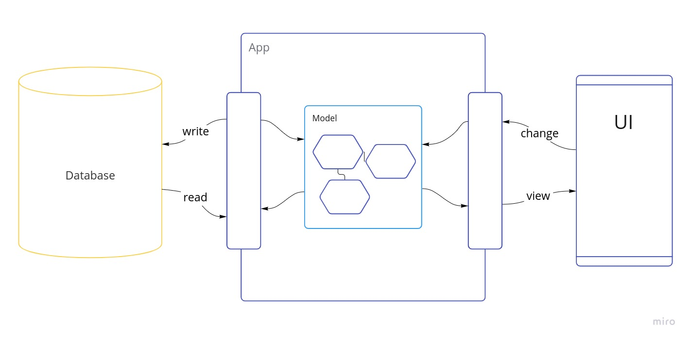
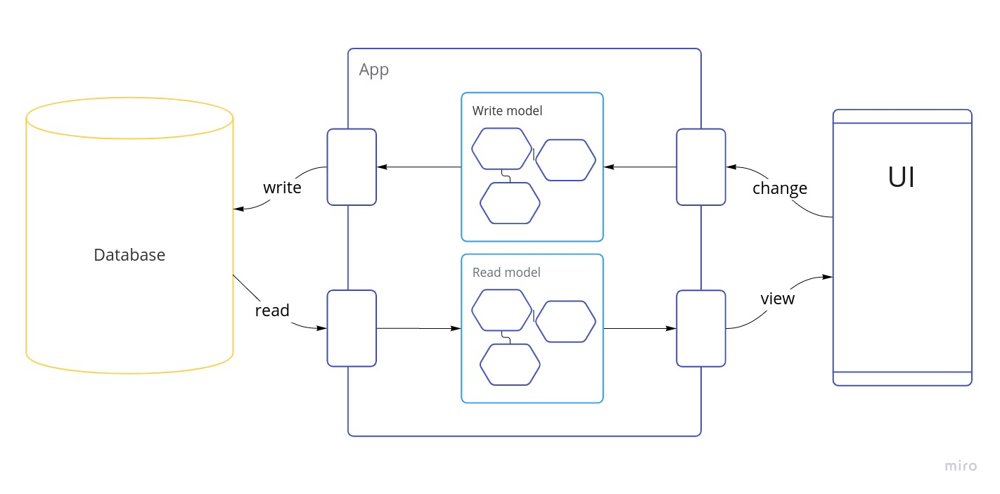
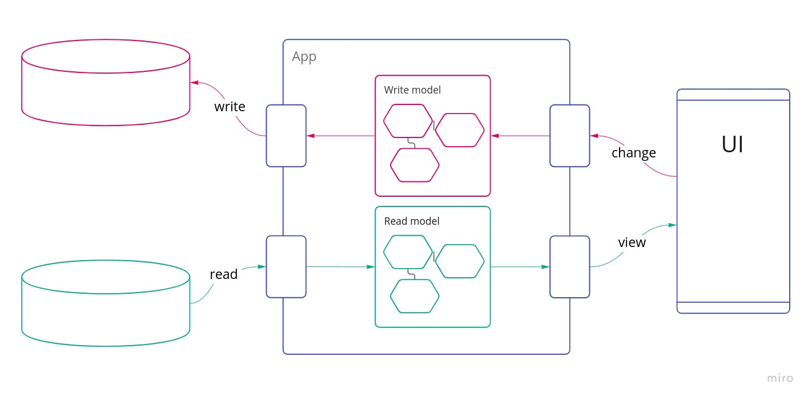
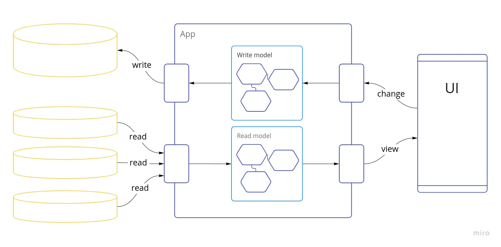

# The *what* and *why* of CQRS
*..in IT Logistics Fashion*

---

## CQR.. what?

---

## Definition
<!-- .element: style="font-size: smaller; text-align: left;" -->

**CQRS stands for Command and Query Responsibility Segregation**, a pattern that
separates read and update operations for a data store. Implementing CQRS in
your application can maximize its performance, scalability, and security. The
flexibility created by migrating to CQRS allows a system to better evolve over
time and prevents update commands from causing merge conflicts at the domain
level.
<!-- .element: style="font-size: smaller; text-align: left;" -->

https://docs.microsoft.com/en-us/azure/architecture/patterns/cqrs
<!-- .element: style="font-size: small; text-align: left;" -->

---

Note:
- this is very boring
- instead let's take a step back and build up some context to better explain what CQRS is

---

Separate models for **reads** and **writes**
<!-- .element: class="fragment" -->

Note:
- very simple

---

---

## ..but why?

Note:
- what problem does it solve?
- why do we want to make the effort of maintaining two models

---

## Performance

Note:
- usually more reads than writes
  - example: web shop
  - users view more offers than they place orders

---

---

## Tradeoffs
- complexity
- eventual consistency

---

## Showcase

---

## Resources

---

- [Martin Fowler: CQRS](https://martinfowler.com/bliki/CQRS.html)

