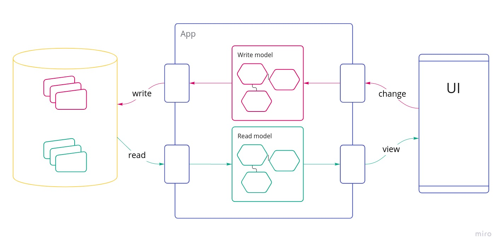
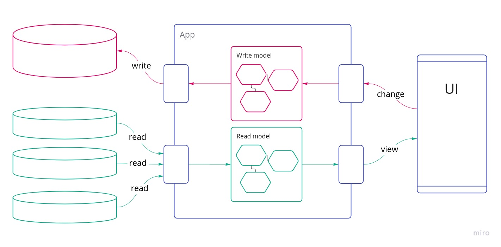
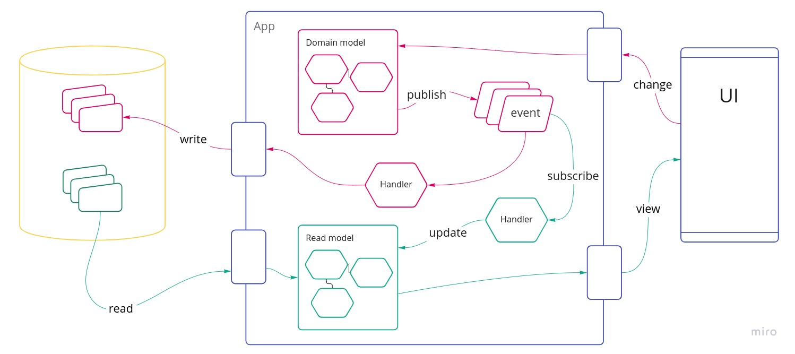

# The *what* and *why* of CQRS
*..in IT Logistics Fashion*

---

## CQR.. what?

---

## Definition
<!-- .element: style="font-size: smaller; text-align: left;" -->

**CQRS stands for Command and Query Responsibility Segregation**, a pattern that
separates read and update operations for a data store. Implementing CQRS in
your application can maximize its performance, scalability, and security. The
flexibility created by migrating to CQRS allows a system to better evolve over
time and prevents update commands from causing merge conflicts at the domain
level.
<!-- .element: style="font-size: smaller; text-align: left;" -->

https://docs.microsoft.com/en-us/azure/architecture/patterns/cqrs
<!-- .element: style="font-size: small; text-align: left;" -->

---

Note:
- this is very boring
- instead let's take a step back and build up some context to better explain what CQRS is

---

Separate models for **reads** and **writes**
<!-- .element: class="fragment" -->

Note:
- very simple

---

---

Note:
- separate object models
- read and write models stored in different tables
- write model: validation of business logic and system constraints
- read model: serving requirements of views

---

Note:
- even though we now have separate models for reads and writes, it's still
  backed up by the same conceptual model
- the read model is just a different representation (e.g. aggregation of
  multiple entities)

---

## ..but why?

Note:
- why do we want to make the effort of maintaining two models

---

## Performance!

Note:
- usually more reads than writes
  - example: web shop
  - users view more offers than they place orders

---

---

---

---

## Tradeoffs

---

### Complexity 😱

---

### Consistency ?

..eventually
<!-- .element: class="fragment" -->

---

## CQRS in Logistics Fashion

---

----

---

---

## 👍

- domain model not compromised for reads
- scale reads and writes independently

---

## 🤔

- complexity 📈
- (eventual) consistency 

---

## Resources

- [Martin Fowler: CQRS (blog post)](https://martinfowler.com/bliki/CQRS.html)
- [Architecture Patterns with Python (book)](http://www.cosmicpython.com/book/chapter_12_cqrs.html)
- [Implementing Domain-Driven Design (book)](https://www.amazon.com/Implementing-Domain-Driven-Design-Vaughn-Vernon/dp/0321834577)
- [Designing data-intensive applications (book)](https://www.amazon.de/-/en/Martin-Kleppmann/dp/1449373321)
---

## Questions?

philipp.albrecht@momox.biz  
  
[@lens on Slack](https://momox.slack.com/team/U0133SVUMHT)

