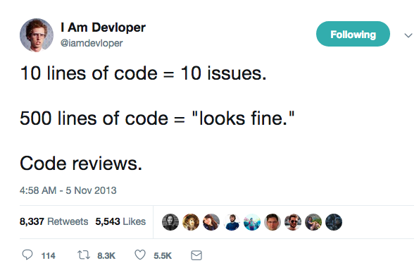
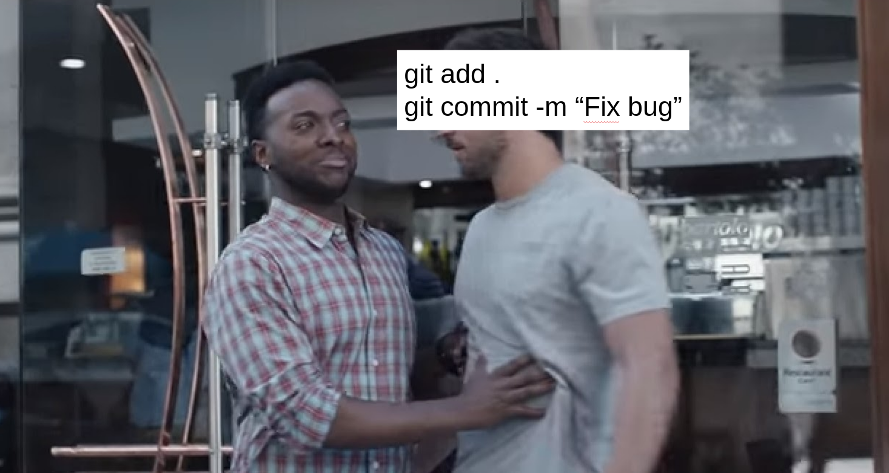
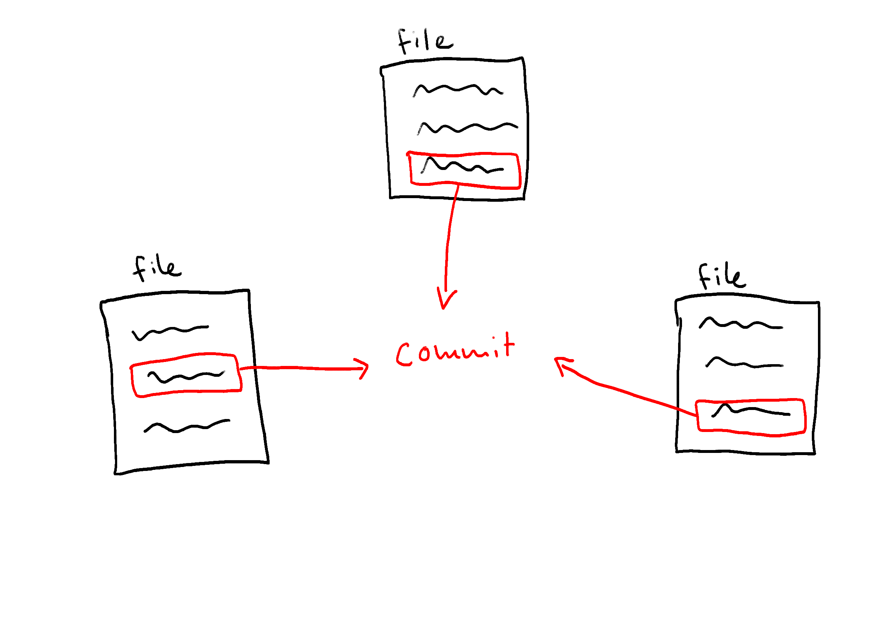

# Git workflows
*..for shaping your commit history*

Note:
Hi guys and welcome to my talk.
Today I want to show you two techniques you can use to shape your commit
history.

**NEXT SLIDE**

---

## But why shape your commit history?

---



Note:
code reviews

Who has not done this, right?  
- It's the end of the day
- Philipp asks you "Can you please have a look at my changes before you leave?
	It's super important. We have to merge this today!"
- you say "Of course! I will have a look."
- you open the diff
- and BAM, 700 lines changed
- so you just skim over it quickly and decide that it's probably fine. Philipp
	knows what he's doing, right?
- So you give it the thumbs up and finally call it a day
- Two hours later production is burning.

This is what I call a *pseudo review*.
You looked at the changes, but you did not really try to properly understand
what's going on.

---

## How can we fix this?  

Note:
How can we support our reviewer?

---

## Provide context!

Note:
How can we provide context?

---

## Commit history!

Note:
So all we need to do is to separate our changes into self-contained commits.
Sounds easy, right?

Turns out creating isolated commits with well defined boundaries, which also
transport the intentions behind your changes, is hard.

Side note_: commit messages are one key aspect of a good commit history, but I
will not talk about how to write good commit messages today. Fawad already
covered this topic extensively in his tech talk, so please check it out!

For me this turned out to be a challenge, because I usually only start to get an
idea of good commit boundaries *after* I'm done writing most of the code.

Let's have a look at an example workflow of fixing a bug.

**NEXT SLIDE**

---

## Fixing a bug  

1. Dive into the bug related code 
<!-- .element: class="fragment" data-fragment-index="2" -->
2. This variable name could be better, I’ll rename that! 🚀
<!-- .element: class="fragment" data-fragment-index="3" -->
3. Oh, I could extract that method here. Great! 🚀
<!-- .element: class="fragment" data-fragment-index="3" -->
4. Done! Oh, cleaning up code feels so good 🤤
<!-- .element: class="fragment" data-fragment-index="3" -->
5. Fix the actual bug 🏆
<!-- .element: class="fragment" data-fragment-index="4" -->

Note:
1. First you start reading the code related to the bug, getting an idea of what is going on.
2. On your way through the code base you - of course- spot some code smells.
	 Being a good boyscout you refactor a little here and there feeling good
	 about yourself, because you're leaving the code a cleaner place than it was
	 before.
3. Then you find the bug and manage to fix it.

Done, right?

**NEXT SLIDE**

----

6. Damn, tests failing because of my refactoring..
7. Just need to rewrite these test cases a little 🔧
8. Tests passing!
<!-- .element: class="fragment" data-fragment-index="2" -->
9. Finally..
<!-- .element: class="fragment" data-fragment-index="3" -->
	```shell
	$ git add .
	$ git commit -m “Fix bug”
	$ git push
	```
10. Review please 👍
<!-- .element: class="fragment" data-fragment-index="3" -->

Note:
1. Nope, some tests are failing because of your refactoring. You rewrite a few bits and hooray..
2. ..tests are passing.
3. Finally, you commit your changes, push and request a review from your colleague.

And here's the problem..

**NEXT SLIDE**

---



Note:
At this point, how can we create meaningful, isolated commits with well defined
boundaries? 

Instead of staging all changes, we could stage single files.  
But what if a commit should span different parts of multiple files?

That brings me to the first technique.

**NEXT SLIDE**

---

## Interactive hunk staging
*git add --patch*

Note:
`--patch` to the rescue!

---



---

```diff[]
$ git add --patch


```

---

```diff[1|2-12|12]
$ git add --patch
diff --git a/talk.py b/talk.py
index c7e0374..585dcd6 100644
--- a/talk.py
+++ b/talk.py
@@ -3,5 +3,5 @@ def give_talk(topic):

 if __name__ == "__main__":
-    topic = "How to hone a straigt razor"
+    topic = "Git workflows"
     give_talk(topic)
(1/5) Stage this hunk [y,n,q,a,d,e,?]?
```

----

```shell[|1|2|6]
y - stage this hunk
n - do not stage this hunk
q - quit; do not stage this hunk or any of the remaining ones
a - stage this hunk and all later hunks in the file
d - do not stage this hunk or any of the later hunks in the file
e - manually edit the current hunk
? - print help
```

<div class="fragment" style="font-size: smaller;">
Configure your editor of choice

```shell
$ git config --global core.editor "nvim"
```
</div>

Note:
Among other options, you can for example say:
1. yes, I want to stage this hunk
2. no, I don't want to stage this hunk
3. I want to manually edit the hunk before staging it
4. For this you might want to configure your editor of choice, otherwise git
	 will use your shell's default editor, which could be vi or vim. And then you
	 would have to google how to exit vim, and so on. So take away: configure
	 your editor of choice!

---
## Shaping commit history

<span class="fragment">*before* committing <span style="color: lightgreen;">✔️</span></span>  

<span class="fragment">*after* committing <span style="color: yellow;">**?**</span></span>

Note:
Now we know a technique for shaping our commit history *before* committing.
What if we already have a bunch of commits and want to reorganize them?
Maybe editting, reordering or deleting certain commits?
Luckily git also provides a way to do that!


TODO: move this to the end of the talk into a general recap
Why is interactive hunk staging awesome?
Because you can do it *after* you wrote your code!

Doing this for a while will teach you how to lay out your commits *while* you're working or even *before* you start writing code.
In general I found this really improved my ability to break down larger things into smaller ones.

---

## Interactive rebasing
*git rebase --interactive*

---

## Rewrite history

- Reword commit messages
<!-- .element: class="fragment" -->
- Reorder commits
<!-- .element: class="fragment" -->
- Squash commits
<!-- .element: class="fragment" -->
- Delete commits
<!-- .element: class="fragment" -->
- ...
<!-- .element: class="fragment" -->

Note:
Isnt' that awesome! You can play fucking God!
---


<span style="font-size: small; text-align: right">https://sportshub.cbsistatic.com/i/2021/04/09/db00f67d-6819-4f7c-bc14-14d516b6431e/rick-and-morty-zeus-1222179.jpg</span>

Note:
You can fix your past mistakes and nobody will ever know!
But with great power comes great responsibility..

---

**Don’t push your work until you’re happy with it!**  
<!-- .element: style="text-align: left" -->

One of the cardinal rules of Git is that, since so much work is local within
your clone, you have a great deal of freedom to rewrite your history locally.
However, once you push your work, it is a different story entirely, and you
should consider pushed work as final unless you have good reason to change it.
In short, you should avoid pushing your work until you’re happy with it and
ready to share it with the rest of the world.
<!-- .element: style="font-size: smaller; text-align: left" -->

https://git-scm.com/book/en/v2/Git-Tools-Rewriting-History
<!-- .element: style="font-size: small; text-align: right" -->

Note:
Generally you should not rewrite history you already pushed. Especially if
other people are relying on that history. Why? I leave that as an exercise for
you to find out.

Feel free to read this giant block of text after the talk. I will make my
slides available on Slack.

So, let's walk through a short example of an interactive rebase.

---

```text[1-7|4|1-3,5-6]
139e19d (HEAD -> bugfix) Fix failing tests
b5a0f1a Extract method
ce52b63 Inline function
a9c4c48 Fix bug
443d809 Move class into separate module
535e5b7 Rename variable
```
<div class="fragment">
ﰬ  

```text[]
26550fe (HEAD -> master) Fix bug
73a2261 Refactor applying the boyscout rule
   |
   +-------------------------------------+
   | Refactor applying the boyscout rule |
   |                                     |
   | - Extract method                    |
   | - Inline function                   |
   | - Move class into separate module   |
   | - Rename variable                   |
   | - Fix failing tests                 |
   +-------------------------------------+
```

</div>

Note:
1. Here we have 6 commits **STEP**
2. Again, it's about fixing a bug, which is represented by this commit **STEP**
3. As you can see, we have a lot of refactoring commits (extract method, etc.) **STEP**

We realize that the refactoring commits are pretty small on their own, so we
want to combine all our refactoring commits into one single commit.

So the goal is to have a resulting commit history like this **STEP**

Here we have just two commits:
1. one for the bugfix
2. and the other one for refactoring, where we keep the information about each
	 refactoring in the commit message

So how do we get there? **NEXT SLIDE**

---

<div style="font-size: smaller;">

```
$ git rebase -i HEAD~6
```
</div>

<span class="fragment" style="font-size: smaller;">
ﰬ  

```text[]
pick 535e5b7 Rename variable
pick 443d809 Move class into separate module
pick a9c4c48 Fix bug
pick ce52b63 Inline function
pick b5a0f1a Extract method
pick 139e19d Fix failing tests

# Commands:
# p, pick <commit> = use commit
# r, reword <commit> = use commit, but edit the commit message
# e, edit <commit> = use commit, but stop for amending
# s, squash <commit> = use commit, but meld into previous commit
# d, drop <commit> = remove commit
# ...
```
</span>

Note:
1. First we do a `git rebase -i` and specify how many commits we want to edit.
	 In this case we go back 6 commits from the current HEAD.
2. This will drop you in your configured editor showing a list of commits

---

<div style="font-size: smaller;">

```
$ git rebase -i HEAD~6
```
</div>
<span style="font-size: smaller;">
ﰬ  

```text[3]
pick 535e5b7 Rename variable
pick 443d809 Move class into separate module
pick a9c4c48 Fix bug
pick ce52b63 Inline function
pick b5a0f1a Extract method
pick 139e19d Fix failing tests

# Commands:
# p, pick <commit> = use commit
# r, reword <commit> = use commit, but edit the commit message
# e, edit <commit> = use commit, but stop for amending
# s, squash <commit> = use commit, but meld into previous commit
# d, drop <commit> = remove commit
# ...
```
</span>

Note:
First action: reording commits

---

<div style="font-size: smaller;">

```
$ git rebase -i HEAD~6
```
</div>
<span style="font-size: smaller;">
ﰬ  

```text[6]
pick 535e5b7 Rename variable
pick 443d809 Move class into separate module
pick ce52b63 Inline function
pick b5a0f1a Extract method
pick 139e19d Fix failing tests
pick a9c4c48 Fix bug

# Commands:
# p, pick <commit> = use commit
# r, reword <commit> = use commit, but edit the commit message
# e, edit <commit> = use commit, but stop for amending
# s, squash <commit> = use commit, but meld into previous commit
# d, drop <commit> = remove commit
# ...
```
</span>

---

<div style="font-size: smaller;">

```
$ git rebase -i HEAD~6
```
</div>

<span style="font-size: smaller;">
ﰬ  

```bash[1-5]
pick 535e5b7 Rename variable
pick 443d809 Move class into separate module
pick ce52b63 Inline function
pick b5a0f1a Extract method
pick 139e19d Fix failing tests
pick a9c4c48 Fix bug

# Commands:
# p, pick <commit> = use commit
# r, reword <commit> = use commit, but edit the commit message
# e, edit <commit> = use commit, but stop for amending
# s, squash <commit> = use commit, but meld into previous commit
# d, drop <commit> = remove commit
# ...
```
</span>

Note:
1. First we do a `git rebase -i` and specify how many commits we want to edit.
	 In this case we go back 6 commits from the current HEAD.
2. This will drop you in your configured editor showing a list of commits

---

<div style="font-size: smaller;">

```
$ git rebase -i HEAD~6
```
</div>

<span style="font-size: smaller;">
ﰬ  

```bash[2-5]
pick 535e5b7 Rename variable
pick 443d809 Move class into separate module
pick ce52b63 Inline function
pick b5a0f1a Extract method
pick 139e19d Fix failing tests
pick a9c4c48 Fix bug

# Commands:
# p, pick <commit> = use commit
# r, reword <commit> = use commit, but edit the commit message
# e, edit <commit> = use commit, but stop for amending
# s, squash <commit> = use commit, but meld into previous commit
# d, drop <commit> = remove commit
# ...
```
</span>

Note:
1. First we do a `git rebase -i` and specify how many commits we want to edit.
	 In this case we go back 6 commits from the current HEAD.
2. This will drop you in your configured editor showing a list of commits

---

<div style="font-size: smaller;">

```
$ git rebase -i HEAD~6
```
</div>

<span style="font-size: smaller;">
ﰬ  

```bash[2-5]
pick 535e5b7 Rename variable
squash 443d809 Move class into separate module
squash ce52b63 Inline function
squash b5a0f1a Extract method
squash 139e19d Fix failing tests
pick a9c4c48 Fix bug

# Commands:
# p, pick <commit> = use commit
# r, reword <commit> = use commit, but edit the commit message
# e, edit <commit> = use commit, but stop for amending
# s, squash <commit> = use commit, but meld into previous commit
# d, drop <commit> = remove commit
# ...
```
</span>

Note:
1. First we do a `git rebase -i` and specify how many commits we want to edit.
	 In this case we go back 6 commits from the current HEAD.
2. This will drop you in your configured editor showing a list of commits

---

<div style="font-size: smaller;">

```
$ git rebase -i HEAD~6
```
</div>

<span style="font-size: smaller;">
ﰬ  

```bash[2-5]
pick 535e5b7 Rename variable
s 443d809 Move class into separate module
s ce52b63 Inline function
s b5a0f1a Extract method
s 139e19d Fix failing tests
pick a9c4c48 Fix bug

# Commands:
# p, pick <commit> = use commit
# r, reword <commit> = use commit, but edit the commit message
# e, edit <commit> = use commit, but stop for amending
# s, squash <commit> = use commit, but meld into previous commit
# d, drop <commit> = remove commit
# ...
```
</span>

Note:
1. First we do a `git rebase -i` and specify how many commits we want to edit.
	 In this case we go back 6 commits from the current HEAD.
2. This will drop you in your configured editor showing a list of commits

---

<div style="font-size: smaller;">

```
$ git rebase -i HEAD~6
```
</div>

<span style="font-size: smaller;">
ﰬ  

```bash[1]
pick 535e5b7 Rename variable
s 443d809 Move class into separate module
s ce52b63 Inline function
s b5a0f1a Extract method
s 139e19d Fix failing tests
pick a9c4c48 Fix bug

# Commands:
# p, pick <commit> = use commit
# r, reword <commit> = use commit, but edit the commit message
# e, edit <commit> = use commit, but stop for amending
# s, squash <commit> = use commit, but meld into previous commit
# d, drop <commit> = remove commit
# ...
```
</span>

Note:
1. First we do a `git rebase -i` and specify how many commits we want to edit.
	 In this case we go back 6 commits from the current HEAD.
2. This will drop you in your configured editor showing a list of commits

---

<div style="font-size: smaller;">

```bash
$ git rebase -i HEAD~6
```
</div>

<span style="font-size: smaller;">
ﰬ  

```sh[]
# This is a combination of 5 commits.
# This is the 1st commit message:

Rename variable

# This is the commit message #2:

Move class into separate module

# This is the commit message #3:

Inline function

...

```
</span>

---

<div style="font-size: smaller;">

```bash
$ git rebase -i HEAD~6
```
</div>

<span style="font-size: smaller;">
ﰬ  

```sh[]
# This is a combination of 5 commits.
# This is the 1st commit message:

Refactor applying the boyscout rule

- Extract method
- Inline function
- Move class into separate module
- Rename variable
- Fix failing tests
- Rename variable


```
</span>

---

```text
$ git log --oneline
26550fe (HEAD -> master) Fix bug
73a2261 Refactor applying the boyscout rule

```
```text
$ git log 73a2261

  Refactor applying the boyscout rule 
  																		
  - Extract method                    
  - Inline function                   
  - Move class into separate module   
  - Rename variable                   
  - Fix failing tests                 
```

Note:
Note that you might run into conflicts during an interactive rebase operation.
I won't cover how to solve conflicts in this talk.

---

## Recap

Note:
What have we learned today?

---

## References

<div style="font-size: smaller;">

- https://nuclearsquid.com/writings/git-add/
- https://git-scm.com/book/en/v2/Git-Tools-Rewriting-History
- https://krishansubudhi.github.io/git/2020/01/20/git-rebase-undo.html
- https://ohshitgit.com/
- [The wonder of good commit messages (Fawad Malik, Tech Talks Vol. 4, 09.04.2021)](https://docs.google.com/presentation/d/1WYYi_J9zUfh2YupIiAfMGt82HchhWW_twqNjmgVTf8g/edit#slide=id.ga635aaf815_0_0)
 
</div>

<style>
.element {
	font-size: smaller;
	}
</style>
