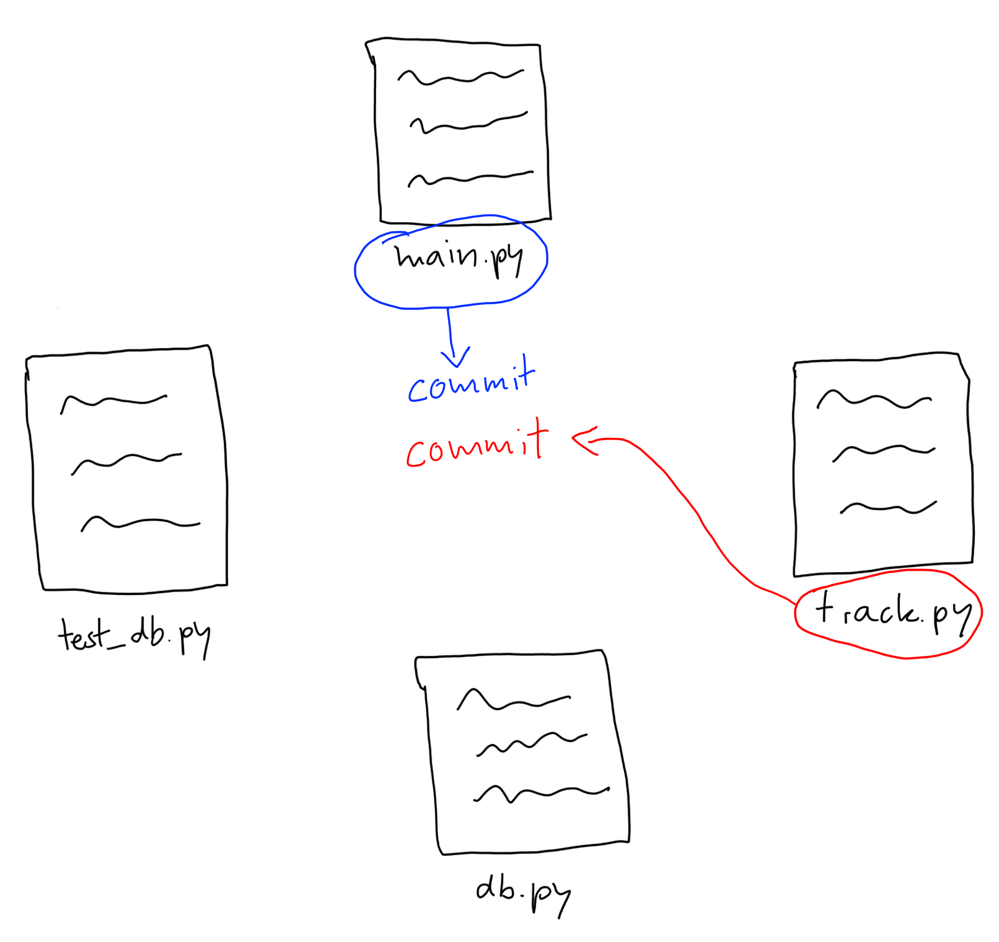

# Git workflows
*..for shaping your commit history*

<br>
<span style="font-size: smaller;">
Philipp Albrecht<br>
</span>

Note:
Hi guys and welcome to my talk!  
My name is Philipp and today I want to show you two techniques for shaping your
git commit history.

- I use these techniques very extensively
- They buy me a lot of flexibility and made my workflow more efficient

So let's dive right in!

---

## Why shape your commit history?  

Note:

- Why do we want to shape our commit history?  
- What is the benefit of a well shaped commit history?

---

## Commit history = context

Note:
- Your commit history is a vehicle to transport context for your changes.
- The changes themselves represent the "what", whereas the commit history represents the *why*
- Context can be helpful
	- for your future self (if you have to debug a bug that is 3 months old)
	- and of course in code reviews
		- providing good context will speed up reviews a lot
		- this makes you more efficient as a team

Side note_: commit messages are one key aspect of a good commit history, but I
will not talk about how to write good commit messages today. Fawad already
covered this topic extensively in his tech talk, so please check it out!

- When I was new to git, creating meaningful self-contained commits was really
	hard for me.
- The point, where I was ready to commit my work, usually was *after* I've done
	all my changes.
- Let's look at an example of fixing a but to show you how this might look like.

---

## Fixing a bug  

1. Dive into the bug related code 
<!-- .element: class="fragment" data-fragment-index="2" -->
2. This variable name could be better, I’ll rename that! 🚀
<!-- .element: class="fragment" data-fragment-index="3" -->
3. Oh, I could extract that method here. Great! 🚀
<!-- .element: class="fragment" data-fragment-index="3" -->
4. Done! Oh, cleaning up code feels so good 🤤
<!-- .element: class="fragment" data-fragment-index="3" -->
5. Fix the actual bug 🏆
<!-- .element: class="fragment" data-fragment-index="4" -->

Note:
1. First you start reading the code related to the bug, getting an idea of what is going on.
2. On your way through the code base you - of course- spot some code smells.
	 Being a good boyscout you refactor a little here and there feeling good
	 about yourself, because you're leaving the code a cleaner place than it was
	 before.
3. Then you find the bug and manage to fix it.

----

6. Damn, tests failing because of my refactoring..
7. Just need to rewrite these test cases a little 🔧
8. Tests passing!
<!-- .element: class="fragment" data-fragment-index="2" -->
9. Finally..
<!-- .element: class="fragment" data-fragment-index="3" -->
	```shell
	$ git add .
	$ git commit -m “Fix bug”
	$ git push
	```
<!-- .element: class="fragment" data-fragment-index="3" -->

Note:
1. Nope, some tests are failing because of your refactoring. You rewrite a few bits and hooray..
2. ..tests are passing.
3. Finally, you commit your changes, push and request a review from your colleague.

And here's the problem..

---


Note:
- At this point, my work tree is full of changes.
- Looking back, I realize that besides fixing the bug, I also did some refactoring.
- So I want to separate refactoring from the actual bugfix in my commits.
- But how?
- We can do better than git add .

---

<div class="r-stack">





</div>

Notes:
- Let's say we have four files.
- Instead of staging all changes, we could stage single files.  
- But this is also very limitting
 
- What if I want to only commit some parts of a single file?
- What if a commit should span different parts of multiple files?

---

## Interactive hunk staging
*git add --patch*

Note:

- Git breaks down your changes into so called "hunks" 
- and lets you interactively decide which parts of your changes you want to add to the index.
- This gives you a chance to review the difference before adding modified contents to the index.

So let me show you how this works.

---

<!-- .element: data-visibility="hidden" -->

```diff[]
$ git add --patch


```

Note:
Git splits up your changes into so called "hunks" and asks you what you want to do with it.

This gives the user a chance to review the difference before adding modified
contents to the index.

---

<!-- .element: data-visibility="hidden" -->

```diff[2-12|12]
$ git add --patch
diff --git a/talk.py b/talk.py
index c7e0374..585dcd6 100644
--- a/talk.py
+++ b/talk.py
@@ -3,5 +3,5 @@ def give_talk(topic):

 if __name__ == "__main__":
-    topic = "How to hone a straigt razor"
+    topic = "Git workflows"
     give_talk(topic)
(1/5) Stage this hunk [y,n,q,a,d,e,?]?
```

----

<!-- .element: data-visibility="hidden" -->

```shell[|1|2|6]
y - stage this hunk
n - do not stage this hunk
q - quit; do not stage this hunk or any of the remaining ones
a - stage this hunk and all later hunks in the file
d - do not stage this hunk or any of the later hunks in the file
e - manually edit the current hunk
? - print help
```

<div class="fragment" style="font-size: smaller;">
Configure your editor of choice

```shell
$ git config --global core.editor "nvim"
```
</div>

Note:
Among other options, you can for example say:
1. yes, I want to stage this hunk
2. no, I don't want to stage this hunk
3. I want to manually edit the hunk before staging it
4. For this you might want to configure your editor of choice, otherwise git
	 will use your shell's default editor, which could be vi or vim. And then you
	 would have to google how to exit vim, and so on. So take away: configure
	 your editor of choice!

---

## Workflow recap
<div class="r-stack">
<span class="fragment">Commit early, commit often.</span><br>
<span class="fragment" style="text-decoration: line-through;">Commit early, commit often.</span>
</div>

1. Hack out code like crazy!
<!-- .element: class="fragment" -->
2. Decide about commit boundaries in retrospect
<!-- .element: class="fragment" -->
3. Create commits with
<!-- .element: class="fragment" -->
```text
$ git add --patch
```
4. Practice 1. - 3.
<!-- .element: class="fragment" -->
5. Commit early, commit often
<!-- .element: class="fragment" -->

---

<div class="r-stack">

```text
fd8c33b Encapsulate variable
ce52b63 Introduce parameter object
443d809 Replace conditional with polymorphism
d397f74 Extract interface
92335de Reword log message
a45ea80 Inline function
62c3ac3 Rename class
da9adf3 Move function to module level
69d0584 Rename method argument
2f09c99 Fix failing tests
d28ba13 Fix bug
b4a6748 Extract method
36962d4 Rename variable
```
<!-- .element: class="fragment" -->

<span class="fragment" style="font-size: 120px;">🤔</span>
</div>

---

## Interactive rebasing
*git rebase --interactive*

---

## Rewrite history

- Reword commit messages
<!-- .element: class="fragment" -->
- Reorder commits
<!-- .element: class="fragment" -->
- Squash commits
<!-- .element: class="fragment" -->
- Delete commits
<!-- .element: class="fragment" -->
- ...
<!-- .element: class="fragment" -->

Note:
Isnt' that awesome! You can play fucking God!
---


<span style="font-size: small; text-align: right">https://sportshub.cbsistatic.com/i/2021/04/09/db00f67d-6819-4f7c-bc14-14d516b6431e/rick-and-morty-zeus-1222179.jpg</span>

Note:
You can fix your past mistakes and nobody will ever know!
But with great power comes great responsibility..

---

**Don’t push your work until you’re happy with it!**  
<!-- .element: style="text-align: left" -->

One of the cardinal rules of Git is that, since so much work is local within
your clone, you have a great deal of freedom to rewrite your history locally.
However, once you push your work, it is a different story entirely, and you
should consider pushed work as final unless you have good reason to change it.
In short, you should avoid pushing your work until you’re happy with it and
ready to share it with the rest of the world.
<!-- .element: style="font-size: smaller; text-align: left" -->

https://git-scm.com/book/en/v2/Git-Tools-Rewriting-History
<!-- .element: style="font-size: small; text-align: right" -->

Note:
Generally you should not rewrite history you already pushed. Especially if
other people are relying on that history. Why? I leave that as an exercise for
you to find out.

Feel free to read this giant block of text after the talk. I will make my
slides available on Slack.

So, let's walk through a short example of an interactive rebase.

---

```text[1-7|4|1-3,5-6]
139e19d (HEAD -> bugfix) Fix failing tests
b5a0f1a Extract method
ce52b63 Inline function
a9c4c48 Fix bug
443d809 Move class into separate module
535e5b7 Rename variable
```
<div class="fragment">
ﰬ  

```text[]
26550fe (HEAD -> bugfix) Fix bug
73a2261 Refactor applying the boyscout rule
   |
   +-------------------------------------+
   | Refactor applying the boyscout rule |
   |                                     |
   | - Extract method                    |
   | - Inline function                   |
   | - Move class into separate module   |
   | - Rename variable                   |
   | - Fix failing tests                 |
   +-------------------------------------+
```

</div>

Note:
1. Here we have 6 commits **STEP**
2. Again, it's about fixing a bug, which is represented by this commit **STEP**
3. As you can see, we have a lot of refactoring commits (extract method, etc.) **STEP**

We realize that the refactoring commits are pretty small on their own, so we
want to combine all our refactoring commits into one single commit.

So the goal is to have a resulting commit history like this **STEP**

Here we have just two commits:
1. one for the bugfix
2. and the other one for refactoring, where we keep the information about each
	 refactoring in the commit message

---

<!-- .element: data-visibility="hidden" -->

<div style="font-size: smaller;">

```
$ git rebase -i HEAD~6
```
</div>

<span class="fragment" style="font-size: smaller;">
ﰬ  

```text[]
pick 535e5b7 Rename variable
pick 443d809 Move class into separate module
pick a9c4c48 Fix bug
pick ce52b63 Inline function
pick b5a0f1a Extract method
pick 139e19d Fix failing tests

# Commands:
# p, pick <commit> = use commit
# r, reword <commit> = use commit, but edit the commit message
# e, edit <commit> = use commit, but stop for amending
# s, squash <commit> = use commit, but meld into previous commit
# d, drop <commit> = remove commit
# ...
```
</span>

Note:
1. First we do a `git rebase -i` and specify how many commits we want to edit.
	 In this case we go back 6 commits from the current HEAD.
2. This will drop you in your configured editor showing a list of commits

---

<!-- .element: data-visibility="hidden" -->
<div style="font-size: smaller;">

```
$ git rebase -i HEAD~6
```
</div>
<span style="font-size: smaller;">
ﰬ  

```text[3]
pick 535e5b7 Rename variable
pick 443d809 Move class into separate module
pick a9c4c48 Fix bug
pick ce52b63 Inline function
pick b5a0f1a Extract method
pick 139e19d Fix failing tests

# Commands:
# p, pick <commit> = use commit
# r, reword <commit> = use commit, but edit the commit message
# e, edit <commit> = use commit, but stop for amending
# s, squash <commit> = use commit, but meld into previous commit
# d, drop <commit> = remove commit
# ...
```
</span>

Note:
First action: reording commits

---

<!-- .element: data-visibility="hidden" -->
<div style="font-size: smaller;">

```
$ git rebase -i HEAD~6
```
</div>
<span style="font-size: smaller;">
ﰬ  

```text[6]
pick 535e5b7 Rename variable
pick 443d809 Move class into separate module
pick ce52b63 Inline function
pick b5a0f1a Extract method
pick 139e19d Fix failing tests
pick a9c4c48 Fix bug

# Commands:
# p, pick <commit> = use commit
# r, reword <commit> = use commit, but edit the commit message
# e, edit <commit> = use commit, but stop for amending
# s, squash <commit> = use commit, but meld into previous commit
# d, drop <commit> = remove commit
# ...
```
</span>

---

<!-- .element: data-visibility="hidden" -->
<div style="font-size: smaller;">

```
$ git rebase -i HEAD~6
```
</div>

<span style="font-size: smaller;">
ﰬ  

```bash[1-5]
pick 535e5b7 Rename variable
pick 443d809 Move class into separate module
pick ce52b63 Inline function
pick b5a0f1a Extract method
pick 139e19d Fix failing tests
pick a9c4c48 Fix bug

# Commands:
# p, pick <commit> = use commit
# r, reword <commit> = use commit, but edit the commit message
# e, edit <commit> = use commit, but stop for amending
# s, squash <commit> = use commit, but meld into previous commit
# d, drop <commit> = remove commit
# ...
```
</span>

Note:
1. First we do a `git rebase -i` and specify how many commits we want to edit.
	 In this case we go back 6 commits from the current HEAD.
2. This will drop you in your configured editor showing a list of commits

---

<!-- .element: data-visibility="hidden" -->
<div style="font-size: smaller;">

```
$ git rebase -i HEAD~6
```
</div>

<span style="font-size: smaller;">
ﰬ  

```bash[2-5]
pick 535e5b7 Rename variable
pick 443d809 Move class into separate module
pick ce52b63 Inline function
pick b5a0f1a Extract method
pick 139e19d Fix failing tests
pick a9c4c48 Fix bug

# Commands:
# p, pick <commit> = use commit
# r, reword <commit> = use commit, but edit the commit message
# e, edit <commit> = use commit, but stop for amending
# s, squash <commit> = use commit, but meld into previous commit
# d, drop <commit> = remove commit
# ...
```
</span>

Note:
1. First we do a `git rebase -i` and specify how many commits we want to edit.
	 In this case we go back 6 commits from the current HEAD.
2. This will drop you in your configured editor showing a list of commits

---

<!-- .element: data-visibility="hidden" -->
<div style="font-size: smaller;">

```
$ git rebase -i HEAD~6
```
</div>

<span style="font-size: smaller;">
ﰬ  

```bash[2-5]
pick 535e5b7 Rename variable
squash 443d809 Move class into separate module
squash ce52b63 Inline function
squash b5a0f1a Extract method
squash 139e19d Fix failing tests
pick a9c4c48 Fix bug

# Commands:
# p, pick <commit> = use commit
# r, reword <commit> = use commit, but edit the commit message
# e, edit <commit> = use commit, but stop for amending
# s, squash <commit> = use commit, but meld into previous commit
# d, drop <commit> = remove commit
# ...
```
</span>

Note:
1. First we do a `git rebase -i` and specify how many commits we want to edit.
	 In this case we go back 6 commits from the current HEAD.
2. This will drop you in your configured editor showing a list of commits

---

<!-- .element: data-visibility="hidden" -->
<div style="font-size: smaller;">

```
$ git rebase -i HEAD~6
```
</div>

<span style="font-size: smaller;">
ﰬ  

```bash[2-5]
pick 535e5b7 Rename variable
s 443d809 Move class into separate module
s ce52b63 Inline function
s b5a0f1a Extract method
s 139e19d Fix failing tests
pick a9c4c48 Fix bug

# Commands:
# p, pick <commit> = use commit
# r, reword <commit> = use commit, but edit the commit message
# e, edit <commit> = use commit, but stop for amending
# s, squash <commit> = use commit, but meld into previous commit
# d, drop <commit> = remove commit
# ...
```
</span>

Note:
1. First we do a `git rebase -i` and specify how many commits we want to edit.
	 In this case we go back 6 commits from the current HEAD.
2. This will drop you in your configured editor showing a list of commits

---

<!-- .element: data-visibility="hidden" -->
<div style="font-size: smaller;">

```
$ git rebase -i HEAD~6
```
</div>

<span style="font-size: smaller;">
ﰬ  

```bash[1]
pick 535e5b7 Rename variable
s 443d809 Move class into separate module
s ce52b63 Inline function
s b5a0f1a Extract method
s 139e19d Fix failing tests
pick a9c4c48 Fix bug

# Commands:
# p, pick <commit> = use commit
# r, reword <commit> = use commit, but edit the commit message
# e, edit <commit> = use commit, but stop for amending
# s, squash <commit> = use commit, but meld into previous commit
# d, drop <commit> = remove commit
# ...
```
</span>

Note:
1. First we do a `git rebase -i` and specify how many commits we want to edit.
	 In this case we go back 6 commits from the current HEAD.
2. This will drop you in your configured editor showing a list of commits

---

<!-- .element: data-visibility="hidden" -->
<div style="font-size: smaller;">

```bash
$ git rebase -i HEAD~6
```
</div>

<span style="font-size: smaller;">
ﰬ  

```sh[]
# This is a combination of 5 commits.
# This is the 1st commit message:

Rename variable

# This is the commit message #2:

Move class into separate module

# This is the commit message #3:

Inline function

...

```
</span>

---

<!-- .element: data-visibility="hidden" -->
<div style="font-size: smaller;">

```bash
$ git rebase -i HEAD~6
```
</div>

<span style="font-size: smaller;">
ﰬ  

```sh[]
# This is a combination of 5 commits.
# This is the 1st commit message:

Refactor applying the boyscout rule

- Extract method
- Inline function
- Move class into separate module
- Rename variable
- Fix failing tests
- Rename variable


```
</span>

---

🥳*

<span style="font-size: smaller;">


```text
$ git log --oneline
26550fe (HEAD -> bugfix) Fix bug
73a2261 Refactor applying the boyscout rule

```
```text
$ git log 73a2261

  Refactor applying the boyscout rule

  - Extract method
  - Inline function
  - Move class into separate module
  - Rename variable
  - Fix failing tests
```

</span>

---

#### \* merge conflicts

<span style="font-size: smaller;">

<div class="fragment">

Resolve conflicts manually and
```text
$ git rebase --continue
```

</div>

<div class="fragment">

..or get out
```text
$ git rebase --abort
```

</div>

</span>

---

## Workflow recap

1. Commit early, commit often  
	 ..or --patch
<!-- .element: class="fragment" -->
3. Revisit your commit boundaries
<!-- .element: class="fragment" -->
4. Reshape history
<!-- .element: class="fragment" -->
```text
$ git rebase -i
```
5. Publish
<!-- .element: class="fragment" -->
```text
$ git push
```

---


<div style="font-size: smaller;">

...**small steps are the key to moving quickly**,  
particularly when working with difficult code.

<span style="font-size: small;">Fowler, 2019, p. 21</span>

</div>

<!-- .element: class="fragment" data-fragment-index="1" -->

Notes:
- I have to admit, these workflows are nothing new.
- People are using these for quite some time already.
- I picked it up from this book.

---

## References

<div style="font-size: smaller;">

- https://nuclearsquid.com/writings/git-add/
- https://git-scm.com/book/en/v2/Git-Tools-Rewriting-History
- https://krishansubudhi.github.io/git/2020/01/20/git-rebase-undo.html
- https://ohshitgit.com/
- [The wonder of good commit messages (Fawad Malik, Tech Talks Vol. 4, 09.04.2021)](https://docs.google.com/presentation/d/1WYYi_J9zUfh2YupIiAfMGt82HchhWW_twqNjmgVTf8g/edit#slide=id.ga635aaf815_0_0)
 
</div>

---


## Questions?

[philipp.albrecht@momox.biz](mailto:philipp.albrecht@momox.biz)

Slack @lens

<style>
.element {
	font-size: smaller;
	}
</style>
